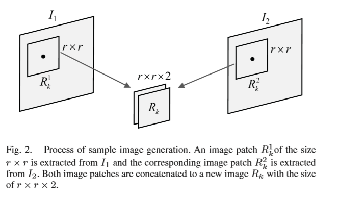

 阅读了实验室的文章 Change Detection From Synthetic Aperture Radar Images Based on Channel Weighting-Based Deep Cascade Network 

[链接](https://ieeexplore.ieee.org/stamp/stamp.jsp?tp=&arnumber=8911214)

> 

### 文章内容

#### 摘要

>本文主要的内容是SAR图像的分类
>
>文章指出随着网络深度的加深，卷积神经网络会遇到一些负面的影响， 例如引入一些冗余的信息和梯度爆炸问题
>
>所以作者提出了一个深度级联网络(DCNet),学习具有区分度的特征，同时使用残差学习来解决梯度爆炸问题，对不同层的输出的特征图进行加权，采用fusion机制来进行融合，最后，利用池化技术来获得逐通道的信息。

#### 网络结构

> 级联的卷积层
>
> 每层输出的特征图加权之后利用fusion机制融合
>
> 最后将所有特征图利用池化得到 channel-wise information
>
> 生成最后的变化map

#### 训练样本生成

> 首先先使用聚类方法将像素分成三类
>
> 变化的，不变的，不确定的
>
> 然后将不变的和变化的进行采样生成训练数据
>
> 训练之后对不确定的样本进行预测

> 对两张不同时间的图片从一个特定像素位置采样一块r*r的区域
>
> 拼接成一个2通道的训练图片

#### 基于通道加权的残差Block

$$
残差学习\\
F(x) := H(x)-x\\
转而学习\\
H(x) := F(x)+x
$$

##### 通道加权的方法

> 对输入的特征图进行卷积得到c个通道的特征图
>
> 分别进行最大值池化和平均池化得到$F_{avg}$和$F_{max}$
>
> 然后分别通过一个全连接层之后进行降维
>
> 再经给一个公共的全连接层生成开关向量
>
> 将这个向量与卷积的特征图进行逐通道的乘，得到$F_{cw}$

$$
F_{avg}\in R^{1\times1\times c} 
$$

$$
F_{max}\in R^{1\times1\times c}
$$

$$
W_{0}\in R^{ \frac {c}{t}*c}
$$

$$
W_{1}\in R^{ \frac {c}{t}*c}
$$

$$
W_{2}\in R^{c* \frac {c}{t}} 
$$

$$
M = σ(W2δ(W0Favg)+W2δ(W1Fmax))
$$
####  Fusion机制

> 对于不同层的特征图输出先采用1*1的卷积使得都成为64通道的输出
>
> 然后通过操作使得特征图大小一致后进行相加得到融合的特征

$F = g1(F1)+g2(F2)) + g3(F3) $

#### 结果生成

将融合的特征经给一系列的全连接层之后

最后成为一个二维的向量$(F_{c}, F_{u})$

在经过Softmax层，最终得到预测的变化和不变的概率
$$
P_c = \frac {e^{F_c}}{e^{F_c} + e^{F_u}}
$$

$$
P_u = \frac {e^{F_u}}{e^{F_c} + e^{F_u}}
$$
训练之后，对不确定的像素的进行预测，最终得到最后的变化结果图

#### 实验结果

​	

> 可见相比于其他的方法基本都有较大的提升

作者同时还分析了加权残差块对训练收敛速度的关系

以及对于不同数据集输入样本的Size的取值

#### 总结

> SAR图像的变化检测实际就是利用两张不同时间的图像进行地面要素的特征的变化与否进行检测
>
> 主要的问题主要在于怎样生成训练样本以及怎样设计网络
>
> 通道加权残差网络利用了残差学习来解决梯度爆炸问题使得网络可以更加的深
>
> 同时使用通道加权，增强了有用的输出通道，从而达到了良好的效果